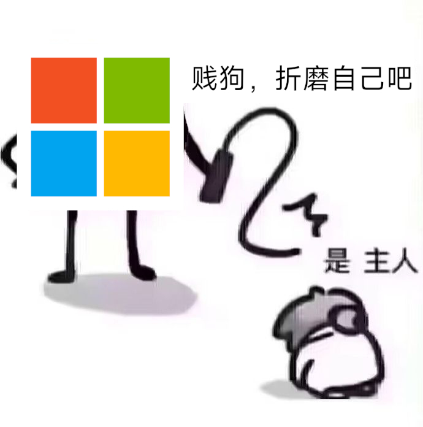

# 欢迎来到创作与游戏操作系统自由运动 Wiki（又称 Fuck Microsoft Wiki）
#### 更新日期：2025.10.16
## 
本Wiki的目的是整理在Linux上面可以用的创作类软件，以及可以玩的游戏

## 
<small>如果你是Mac用户，也想参与创作与游戏操作系统自由运动 Wiki（尤其是游戏），不妨fork此工程，使用GitHub Pages实现，该站可提供传送门</small>

### 
 如果你也想参与贡献，欢迎来到Git提issue 
 

   

## 本页面结构

    Index：你所看到的页面，关于这个项目
        VisualFreedom   # 可在Linux下使用的视觉传达
        GamesFreedom    # 可在Linux下正常游玩的游戏
        MusicFreedom    # 可在Linux正常使用的音频制作工具

### 
 ✨ 星星之火，可以燎原 ✨ 
 
### 
 ✨ 希望各位可以一起参与该Wiki的编写！ ✨ 

